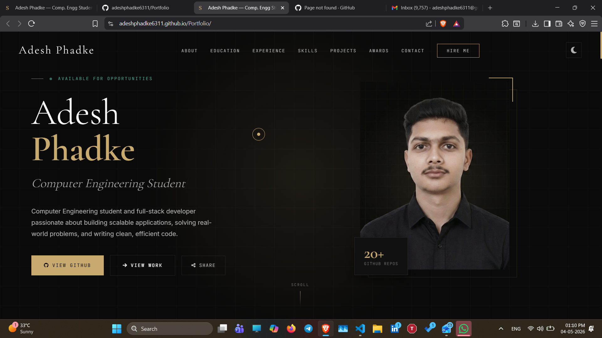

# 🚀 Adesh Phadke — Developer Portfolio

A modern, responsive **developer portfolio website** showcasing my work, skills, achievements, and projects.

Designed with a focus on **clean UI, smooth animations, and professional presentation**.

---

## 🌐 Live Website

👉 https://adeshphadke6311.github.io/Portfolio/

---

## 📌 About Me

I am a **B.E. Computer Engineering student** passionate about:

- 💻 Full-Stack Development  
- 🤖 Artificial Intelligence  
- 🚀 Building real-world impactful solutions  

---

## ✨ Features

- 🌙 Dark / Light mode toggle  
- ⚡ Smooth animations & transitions  
- 🎨 Modern UI design  
- 🔍 Project filtering & search  
- 🏆 Certificates modal system  
- 📬 Working contact form (Formspree integration)  
- 📱 Fully responsive design  
- 🔗 Social media links  

---

## 🛠 Tech Stack

### Frontend
- HTML5  
- CSS3  
- JavaScript  

### Libraries
- Font Awesome  
- Google Fonts  

### Deployment
- GitHub Pages  

---

## 📸 Preview

### 💻 Dashboard


---

## ⚙️ Setup & Installation

Clone the repository:

```bash
git clone https://github.com/adeshphadke6311/Portfolio.git